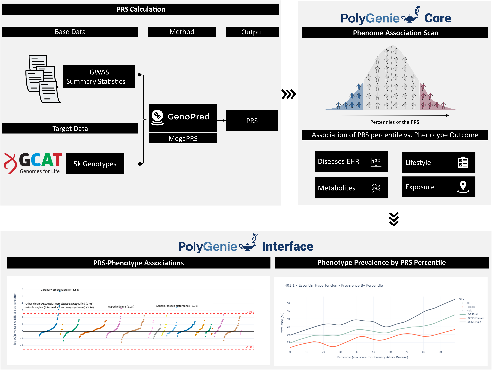

# About PolyGenie

## What is PolyGenie?

PolyGenie is a cohort-agnostic framework for phenome-wide association studies (PheWAS) based on polygenic risk scores (PRS). It provides a reproducible Nextflow pipeline and an interactive web interface for exploring associations between precomputed PRS and a wide range of phenotypes across population cohorts.

PolyGenie does **not** perform PRS computation. It is designed to ingest PRS generated by any external tool and integrate them with cohort-level phenotype data to enable systematic PRS–phenotype association analyses.

The framework can be applied to any dataset with compatible PRS and phenotype information. This repository includes a fully worked implementation using the [GCAT (Genomes for Life)](https://www.igtp.cat/gcat) cohort as a representative use case and reproducibility resource.

If you want to use PolyGenie you can get the pipeline from the original github repository [PolyGenie Github](https://github.com/gcatbiobank/polygenie-pipeline/).

---

## How It Works

PolyGenie operates downstream of PRS construction. Precomputed PRS, together with cohort-specific phenotype data, are provided as inputs to a scalable Nextflow pipeline that performs phenome-wide association scans and stratified prevalence analyses.

In the GCAT implementation provided here, PRS were computed externally using the MegaPRS method via the [GenoPred pipeline](https://github.com/opain/GenoPred) prior to running PolyGenie. These scores were then analyzed by PolyGenie to assess associations with diseases (ICD-10 and Phecodes), metabolites, lifestyle traits, and environmental exposures.

PolyGenie produces standardized association statistics and percentile-based prevalence estimates, stored in a SQLite database and exposed through an interactive Dash web interface. This interface enables exploration of PRS distributions, PRS–phenotype associations, and phenotype prevalence across PRS percentiles, stratified by sex.

*Overview of the PolyGenie framework. PolyGenie operates downstream of PRS computation, ingesting precomputed PRS to perform phenome-wide association analyses and interactive result exploration.*

---

## Contact & Citation

PolyGenie is developed and maintained by researchers at [GCAT | Genomes for Life](https://www.igtp.cat/gcat), Institut Germans Trias i Pujol, Badalona, Spain.

For questions or feature suggestions, please open an issue on [GitHub](https://github.com/gcatbiobank/polygenie-gcat/issues) or contact us at xfarrer@igtp.cat.

If you use PolyGenie in your research, please cite our application note (forthcoming).
